# EggSPEED

<p align="center">
  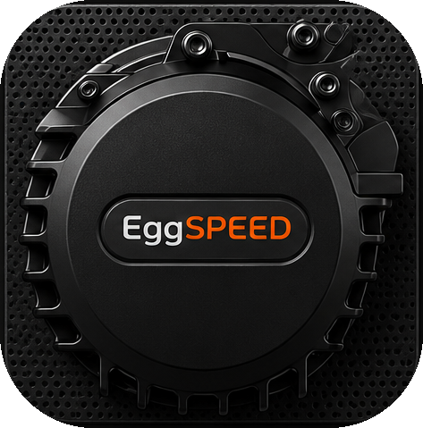
</p>

<p align="center">
  A modern Android app for Bafang BBS01 / BBS02 / BBSHD mid-drive controllers, talking directly to the controller over UART (USB OTG programming cable), now supporting both factory OEM Bafang firmware and <a href="https://github.com/danielnilsson9/bbs-fw">bbs-fw</a>, switchable in Settings.
</p>

<p align="center">
  <a href="https://spotrobotics.app/eggspeed/">Presentation page</a>
  &nbsp;|&nbsp;
  <a href="https://spotrobotics.app/support/">Support</a>
</p>

<p align="center">
  <a href="media/Github_V3.mp4">▶️ Watch demo video</a>
</p>

<table align="center">
  <tr>
    <td>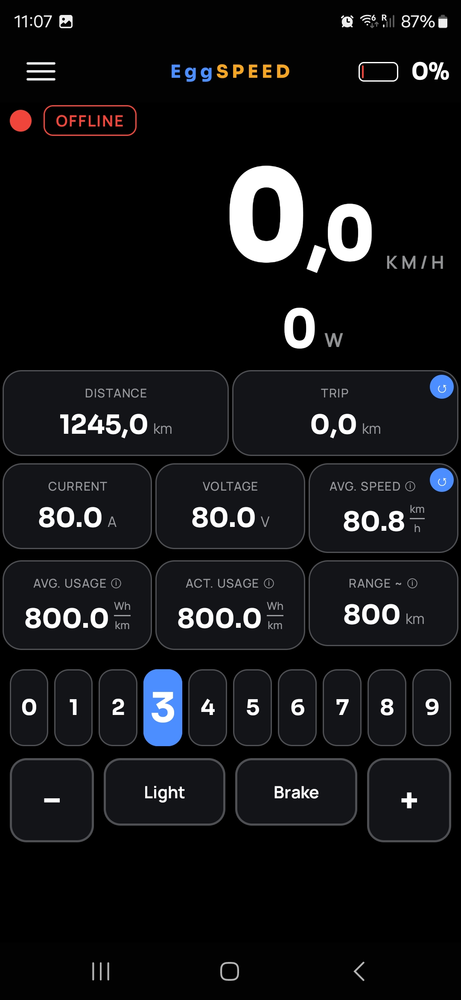</td>
    <td>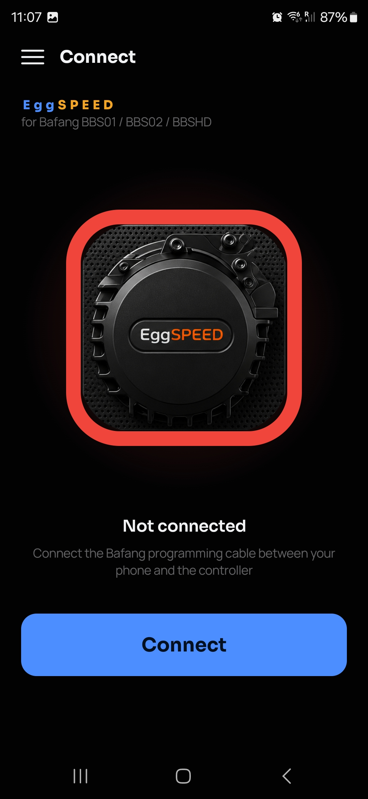</td>
    <td>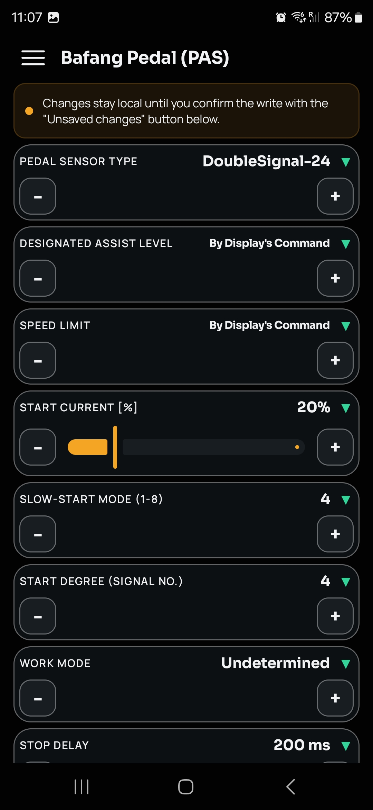</td>
    <td>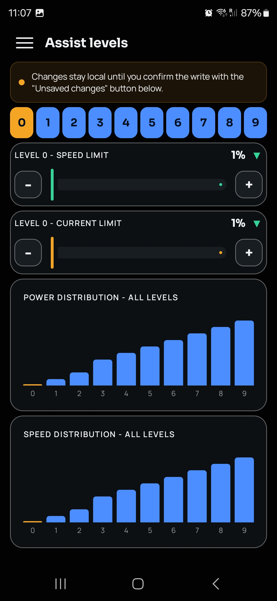</td>
    <td>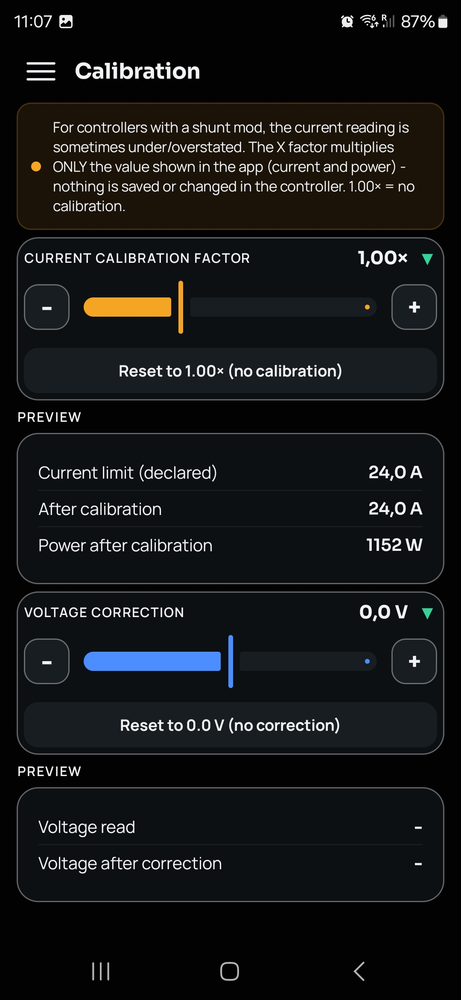</td>
    <td>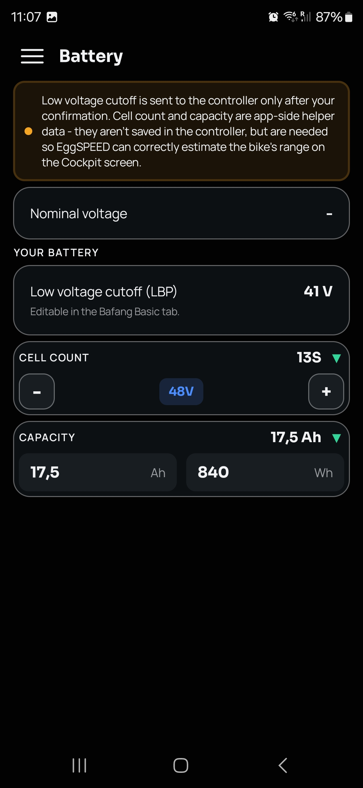</td>
  </tr>
</table>

## Features

1. **Full Bafang display replacement** - a live cockpit showing everything the factory display shows, and more.
2. **Live controller programming** - write Basic, Pedal Assist, and Throttle parameters directly to the controller, even while riding.
   - **Motor assist level control** - switch between assist levels 0-9 on the fly, exactly like the stock display.
3. **Dual firmware support** - switch between factory OEM Bafang firmware and [bbs-fw](https://github.com/danielnilsson9/bbs-fw) in Settings. EggSPEED speaks both configuration protocols natively, with dedicated screens for bbs-fw's own settings (System, Assist Levels, firmware/version info) built to match the field names and layout of bbs-fw's own official Windows configuration tool.
4. **Current calibration** - correct the app's displayed current/power reading for controllers with a shunt mod. This only adjusts what's shown in the app - nothing is written to the controller.
5. **Voltage calibration** - apply a manual offset to correct the estimated pack voltage shown in the cockpit.
6. **Battery range estimate** - predicted remaining range in km, blending your riding history with your current riding style.
7. **Instantaneous power draw** - live battery power usage in watts.
8. **Average energy usage** - trip-average and short-term energy consumption in Wh/km.
9. **Firmware-aware profiles** - save/export/import named configuration profiles; loading is blocked with a clear error if the profile's firmware doesn't match the one currently selected, instead of silently writing into the wrong fields.
10. **PROTECT Police Control mode** - lock assist to 0 with one tap on the Cockpit while the screen keeps responding normally to +/- taps, so it looks unchanged at a glance. A PIN-gated PROTECT tab is the only way to turn it back off.
11. **Live monitoring charts** - power, current, voltage, and speed plotted over time, each independently toggleable, with a 10-minute rolling history.
12. **Light/Dark theme** - switchable in the Screen tab; High Contrast works in both.
13. **Cockpit on lock screen/AOD** - optional, shows speed/power/assist via a "now playing"-style media notification so the screen can actually sleep while riding, saving real battery. Optional +/- assist controls repurpose the previous/next media buttons.
14. **SAG (battery voltage sag under load)** - an Estimated SAG calculated continuously from your normal riding, plus a guided SAG Measurement procedure (rest → full load → rest) for a controlled, comparable reading with a battery-quality legend.

### BBS-FW screens

<table align="center">
  <tr>
    <td>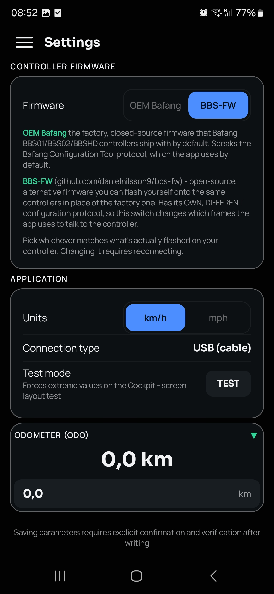</td>
    <td>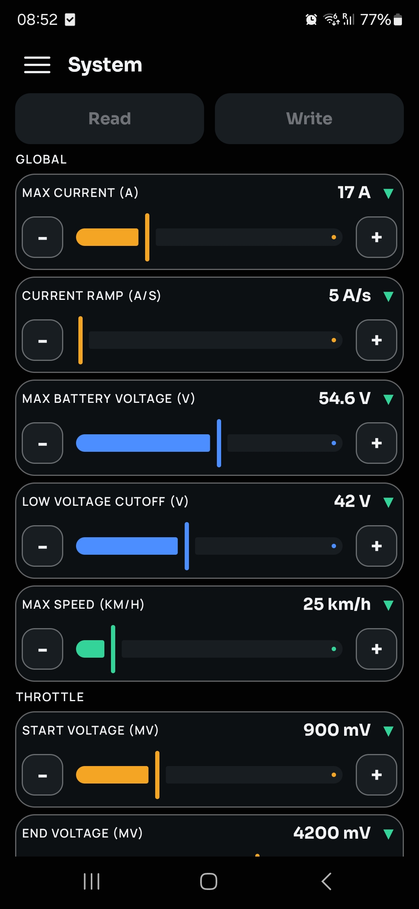</td>
    <td>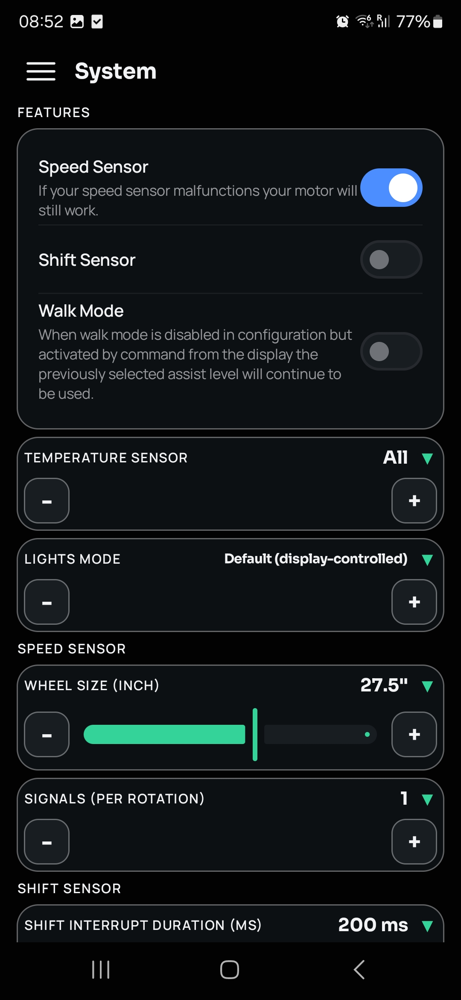</td>
    <td>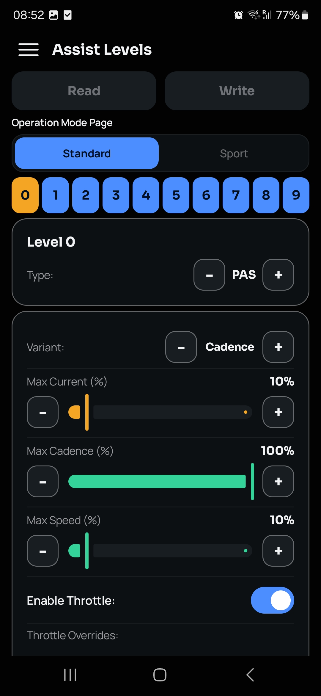</td>
  </tr>
</table>

## Download

EggSPEED is currently in **closed testing** on Google Play, so the install link only works for testers. It takes two clicks to get in:

1. **[Join the tester group](https://groups.google.com/g/eggspeed)** - sign in with the same Google account you use on the Play Store, then hit "Join group".
2. **[Open the Play Store testing link](https://play.google.com/apps/testing/app.spotrobotics.eggspeed)** on your phone - once you're a member, Google Play unlocks the install button for you automatically.

That's it - after the first install, EggSPEED updates itself through Google Play like any other app.

## Safety model

EggSPEED can read from and write to the controller's configuration - it is no longer read-only, on either firmware. It never flashes firmware, and firmware flashing is not planned at all. On OEM Bafang, commands sent to the controller fall into four categories:

| Command | Bytes | Nature |
|---|---|---|
| Read GEN/BAS/PAS/THR blocks | `0x11 + address` | pure read |
| Telemetry (brake/battery/speed/current) | `0x11 + 0x08/0x11/0x20/0x0A` | pure read |
| Display init / light / assist level | `0x16 0x1A 0xF0/0xF1` / `0x16 0x0B <code> <checksum>` | transient, same as the factory display - doesn't modify persistent memory |
| Write BAS/PAS/THR block | `0x16 + address + data + LRC` | persistent write to controller flash |

On bbs-fw, the protocol is bbs-fw's own (request type `0x01` read / `0x02` write + opcode, same checksum algorithm) - it explicitly rejects the OEM Bafang Configuration Tool's frames, so the two protocols never collide on the wire:

| Command | Bytes | Nature |
|---|---|---|
| Read firmware version / config | `0x01 + 0x01/0x03` | pure read |
| Telemetry (bbs-fw's own display-compat layer, 9 known registers) | `0x11 + 0x08/0x0A/0x11/0x20/0x21/0x22/0x24/0x25/0x31` | pure read |
| Write config | `0x02 + 0xF1 + config bytes + checksum` | persistent write to controller flash, ACK'd by the controller |

Every write goes through two safety layers before anything is sent:
1. **Client-side clamping** - every value is coerced into a conservative, protocol-safe range before the write frame is even built, regardless of where the value came from (bbs-fw ranges are taken directly from the author's own official Windows tool source, including controller-aware current limits: BBSHD 33A / BBS02 30A / TSDZ2 20A).
2. **Controller-side confirmation** - the controller validates the write itself and returns a status code; the app decodes it and surfaces a specific error message instead of a generic failure.

### Core features
- USB OTG connection (Bafang programming cable, UART 1200 baud 8N1; DTR/RTS asserted on OEM only - bbs-fw's own official tool never touches them)
- Controller identification (OEM: manufacturer, model, HW/FW versions, voltage, max current; bbs-fw: firmware version, config format version, controller type)
- Full configuration read and write: OEM Basic / Pedal Assist / Throttle, or bbs-fw System / Assist Levels
- Live dashboard: speed (wheel RPM × circumference), battery %, power W (estimated on OEM, real ADC reading on bbs-fw), brake
- Display-style controls: assist level 0-9, light, Sport/Normal ride mode toggle (bbs-fw)
- Distance counter (speed integration on the app side)

### What EggSPEED deliberately does NOT do
- Flash firmware (not planned at all)
- Bluetooth (planned for the future - needs its own hardware bridge)

## Building

```
JAVA_HOME=<jdk17+> ../tools/gradle-8.10.2/bin/gradle assembleDebug
```

APK: `app/build/outputs/apk/debug/app-debug.apk`. Requires Android 8.0+ (API 26) and a phone with USB Host (OTG).

Unit tests for the protocol layer (framing, LRC, WD/SMM/SMS decoding, 0xFF sentinels):

```
gradle testDebugUnitTest
```

## Architecture

```
app/src/main/java/com/bafspeed/app/
  protocol/            # Protocol layer - pure Kotlin, no Android dependency
    Lrc.kt             # checksum (byte sum mod 256), shared by both protocols
    BafangCommands.kt  # OEM Bafang commands (reads, writes, transient display commands)
    BafangModels.kt    # OEM data models + GEN/BAS/PAS/THR block decoders
    ConfigFrameParser.kt   # OEM config response framing
    DisplayStateMachine.kt # telemetry loop (controller polling cycle state machine), shared by both firmwares
    BbsFwCommands.kt   # bbs-fw commands (read FW version/config, write config)
    BbsFwModels.kt     # bbs-fw config_t model (1:1 with cfgstore.h) + assist level model
    BbsFwFrameParser.kt    # bbs-fw response framing
    BbsFwValidation.kt # bbs-fw field validation ranges (from the official Windows tool's Configuration.cs)
    BbsFwWriteResponseParser.kt # bbs-fw write ACK parsing
    BbsFwWriter.kt      # builds the bbs-fw config write frame
  profile/
    ProfileIo.kt        # OEM profile format - .ini, compatible with the factory Bafang Configuration Tool
    BbsFwProfileIo.kt   # bbs-fw profile format - Base64 of the same config bytes sent over the wire, tagged with a firmware marker + CONFIG_VERSION check
  serial/
    UsbSerialManager.kt    # USB OTG UART (usb-serial-for-android), 1200 baud 8N1, DTR/RTS asserted on OEM only
  ui/                  # Jetpack Compose, custom design tokens
    screens/BbsFwInfoScreen.kt, BbsFwSystemScreen.kt, BbsFwAssistLevelsScreen.kt  # bbs-fw-only screens
  AppViewModel.kt      # app state, connection sequence, display mode, firmware switch
```

## Known protocol gotchas (relevant to writing)

### OEM Bafang
1. **SMM in the BAS block**: writing SMM=1 as `0x10` is inconsistent with the Bafang standard - the controller expects `SMM*64` in the upper bits. Use `SMM*64 + SMS` when writing.
2. **0xFF sentinel**: DA/SL/WM = "display-controlled" encodes as `0xFF`, other values use offsets (DA-1, SL+14, WM+9).
3. **Wheel diameter**: `WD==12(700C) → 55; WD<12 → (WD+16)*2; WD>12 → (WD+15)*2`.
4. **24V power formula**: `21.7 + 7.7·bat%`.
5. The controller validates writes and returns per-parameter error codes - the app still validates client-side before sending (see Safety model above).

### bbs-fw
1. **Always verify against the latest tagged GitHub release, not `main`** - `main` can contain merged-but-unreleased struct changes (this bit us once: our config model briefly matched an unreleased `CONFIG_VERSION=5` struct instead of the shipping `v1.5.0`/`CONFIG_VERSION=4`, which every real controller in the wild actually runs).
2. **Don't assert DTR/RTS** - the official `BBSFWTool.exe` never touches them (both stay at the .NET default `false`); forcing them high broke the connection for testers.
3. **Retry the initial identification read** - the official tool resends the firmware-version request every 200ms for up to 120s rather than giving up after one timeout; controllers can be slow to respond on the programming port.
4. **`try_process_bafang_read_request` (bbs-fw's display-compat layer) only implements 9 opcodes** - it silently ignores everything else, including the OEM Configuration Tool's GEN/BAS/PAS/THR block reads (`0x51`-`0x54`) - by design, not a bug.

## Changelog

## v0.3.55 - 2026-08-24 (versionCode 57)
- Monitoring and AOD (lock screen) telemetry now run independently of the Cockpit - previously the polling loop against the controller only ran while Cockpit or Calibration was open, so Monitoring charts and the AOD lock-screen widget stayed frozen unless Cockpit had already been opened first in the same session. A new `syncDisplayPolling` in AppViewModel is now the single place starting/stopping the loop, driven by whichever of Cockpit/Monitoring/AOD currently needs it.
- The protocol library gained a `writesEnabled` flag: when the polling loop is running only for Monitoring (no Cockpit/Calibration/AOD open), it reads speed/power/current/voltage etc. without ever sending assist-level/mode/light write commands - safe to leave running while riding under the factory display's own control.
- The telemetry loop now pauses automatically whenever a config read/write screen (Settings, Assist Levels, etc.) is open, since that screen needs the serial bus to itself - a short notice appears under the Read/Write buttons while Monitoring/AOD are paused this way, and both resume on their own once you leave the screen.
- Connection status text now keeps separate PL/EN copies instead of one already-translated string, fixing a stale-language message left over after switching languages mid-session in Settings.
- Monitoring charts: a series that's nearly flat (e.g. voltage over a short window) now draws as a flat line centered in the chart instead of collapsing to the very bottom from an artificial fallback range.
- Connect screen: content now scrolls, the connecting spinner runs slower and keeps spinning while CONNECTED, and vertical spacing was tightened.
- AOD lock-screen widget refresh interval shortened from 1.5s to 1s; small visual polish on the SAG tab title and instructions text.
- (versionCode 52-56 / v0.3.50-v0.3.54 were internal iterations of this same work, not released individually.)

## v0.3.49 - 2026-08-21 (versionCode 51)
- New "SAG" tab (menu, next to Battery) - two battery voltage-sag figures: an "everyday" value calculated continuously in the background from your normal riding (paired open-circuit/loaded voltage samples, smoothed), and a guided calibration procedure (2 min rest → 30s full load → 2 min rest) giving a controlled, comparable measurement with the charge level, test current, and timestamp recorded. Both are simple derived voltage-drop figures, not an engineering-grade resistance measurement.

## v0.3.48 - 2026-08-20 (versionCode 50)
- New "Screen" tab (menu, under Settings) - moved Theme/High contrast here from Settings, plus a new optional "Show Cockpit on lock screen/AOD" feature: speed/power/assist level shown via a "now playing"-style media notification (the only public Android mechanism that lets the screen actually sleep while still showing content) - real battery saving vs. keeping the screen lit. Optional +/- assist controls repurpose the previous/next media buttons (off by default - can conflict with real music/Bluetooth controls). Requires notification permission.

## v0.3.47 - 2026-08-20 (versionCode 49)
- New Light theme (Settings, next to High contrast) - dark stays the default, unchanged look; High contrast now works in both themes
- Menu: added a GitHub link (source code) next to Contact/Website
- Renamed the "Service" tab to "PROTECT" (drawer menu and its own screen)

## v0.3.46 - 2026-08-19 (versionCode 48)
- New "High contrast" toggle in Settings (right after Odometer) - brightens the app's faded gray text (menu items, labels throughout the app, Cockpit) to near-full white for readability in direct sunlight
- Hamburger menu: larger list item font
- Battery voltage tile: the three threshold labels (LBP / Nominal / Upper limit) now render at higher contrast, independent of the new High contrast toggle
- Cockpit: larger text on the Light/Brake/Mode tiles (tile size unchanged)

## v0.3.45 - 2026-08-19 (versionCode 47)
- Fixed speed/current/distance stuck at zero and frequent USB disconnects on OEM Bafang controllers - the telemetry polling loop queried several registers (Normal/Sport mode, real ADC voltage, controller/motor temperature, status/unknown3/moving diagnostics) that OEM firmware doesn't reliably answer; if one didn't respond, the sequential state machine got stuck before ever reaching speed/current. New `extendedRegistersEnabled` flag (mirrors the existing bbs-fw-only `useRealVoltage`) skips those extra registers on OEM, going straight brake -> battery -> speed -> current -> light. bbs-fw unaffected. Confirmed fixed by an affected BBS01 tester.
- New Monitoring tab: live power/current/voltage/speed charts, each independently toggleable, sampled every 0.5s with a 10-minute rolling buffer
- Battery screen: merged the three separate voltage tiles (low voltage cutoff, nominal voltage, upper charge limit) into one expandable "Battery voltage" tile with a color-coded per-threshold explanation
- Connect screen: now shows which firmware is currently selected (OEM Bafang / BBS-FW), active one highlighted green
- Menu: clearer tab names (e.g. "Bafang Assist levels", "BBS-FW System", "BBS-FW Assist Levels"), "All in View" moved to sit right after its matching Assist Levels tab instead of floating separately in the list
- Service tab: reworded the PROTECT feature toggle description
- Cockpit: removed the redundant colored status dot next to the ONLINE/OFFLINE badge (the badge's own color and text already convey connection state)

## v0.3.37 - 2026-08-16 (versionCode 39)
- Battery: fixed "Your battery" showing two near-identical high-voltage rows (bbs-fw's real "Max voltage" register next to the calculated "Upper charge limit") - now three consistently-calculated, expandable tiles in ascending order: Low voltage cutoff (LBP), Nominal voltage, Upper charge limit, each with a green-triangle expandable explanation

## v0.3.36 - 2026-08-16 (versionCode 38)
- Calibration: "Preview" labels split into "Current preview" and "Voltage preview" so it's clear which tile shows what
- Battery: merged the "Nominal/Max voltage" tile into "Your battery", and added a calculated upper charge limit (cell count x 4.2V) next to the existing low voltage cutoff (LBP)
- Service: rewrote the PROTECT explanation banner, and switched the "PROTECT feature" ON/OFF control to the same switch style used by Speed Sensor in Features

## v0.3.35 - 2026-08-15 (versionCode 37)
- Service tab: dropped the "0000" default PIN concept - the tab is simply open until you set your own PIN inside it
- Service tab: rewrote the PROTECT explanation banner, reformatted the "PROTECT feature" tile (text was touching the control) and switched it to a clear ON/OFF button, and the PROTECT status card is now always visible (green "PROTECT is ON" / red "PROTECT is OFF") instead of only appearing while active

## v0.3.34 - 2026-08-15 (versionCode 36)
- New PROTECT anti-robbery button on the Cockpit (both OEM and BBS-FW) - locks assist to 0 for real while the screen keeps responding normally to +/- taps, so it looks unchanged at a glance. Same shape as the ONLINE/OFFLINE badge, top right.
- New "Service" tab (hamburger menu) - PIN-gated (default "0000" = open), the only way to turn PROTECT back off once armed. Also has the master switch for whether the PROTECT button exists on the Cockpit at all, and lets you set your own PIN.

## v0.3.33 - 2026-08-15 (versionCode 35)
- Calibration: the voltage preview now shows something useful offline too - falls back to the last known voltage from before disconnecting, or to an estimate from the nominal pack voltage if there's no history yet (fresh install)

## v0.3.32 - 2026-08-15 (versionCode 34)
- Calibration: the voltage preview tiles ("Voltage read" / "Voltage after correction") now actually update - the screen wasn't starting the telemetry polling loop, so they stayed stuck at 0.0 unless the Cockpit had already been visited first in the same session
- Settings: removed a stray, unrelated footer line ("Saving parameters requires...") that didn't apply to anything on this screen
- Settings: "Connection type" moved out of the Application card into its own tile at the bottom, now showing a USB/Bluetooth switch (Bluetooth not implemented yet - inactive, always USB)

## v0.3.31 - 2026-08-15 (versionCode 33)
- Test mode toggle moved from Settings to the top of the Diagnostics tab
- Cockpit: Tc (controller temperature) tile now left-aligned flush with the Distance tile below it, instead of sitting slightly indented

## v0.3.30 - 2026-08-15 (versionCode 32)
- Protocol/serial layer split out into its own library - no functional changes, test release to confirm the build is still correct after this restructuring

## v0.3.29 - 2026-08-13 (versionCode 31)
- New "Temperature control" tab (bbs-fw only - the motor temperature register, 0x21, always returns 0 on bbs-fw regardless of configuration, so the app deliberately only exposes the controller reading, Tc, instead of showing a second tile that could never show real data)
- Cockpit: new Tc tile (controller temperature), shown/hidden via a toggle in the new tab, positioned on the left side at roughly the power reading's height
- Two configurable thresholds for Tc: "Warning" (lower, highlights the tile orange) and "Alarm" (higher, blinks the tile red and plays a one-time beep - re-arms only after the temperature drops back below the threshold, with its own mute toggle)
- Test mode now also forces Tc to 100°C and the battery indicator to 100%, on top of the values it already forced
- README now embeds the full contents of this changelog at the bottom, so it's visible directly instead of only through a link

## v0.3.26 - 2026-08-11 (versionCode 28)
- **Merged bbs-fw (Daniel Nilsson firmware) support into the main release.** This had been developed and tested separately as OSF test builds (v0.3.18-OSF through v0.3.25-OSF, see below) with an external tester over several rounds of connection, config-version, and UI fixes, and is now considered stable enough to ship - EggSPEED now supports both factory OEM Bafang firmware and bbs-fw from a single app, switchable in Settings
- Drawer menu: "Menu" moved to the very top of the list (kept its normal, un-highlighted look after feedback)
- Settings: firmware description rewritten into two clearly separated paragraphs, with "OEM Bafang" and "BBS-FW" highlighted in green - and the firmware switch option relabeled "bbs-fw" → "BBS-FW"
- Cockpit: nudged the current-power readout 1.5 characters further left
- Carries forward everything from the OSF test track below (BBS-FW Version label, bigger EggSPEED wordmark, red Sport button, green triangle info indicators, expanded test-mode values, full bbs-fw config read/write/profile support, etc.)

## v0.3.25-OSF - 2026-08-11 (versionCode 27)
- Drawer menu: "Menu" now sits at the very top, in a larger, amber-highlighted row to draw attention (rate the app / check for updates live there) - the rest of the menu is unchanged, app still launches on Connect as before
- Renamed the "bbs-fw - Version" drawer entry to "BBS-FW Version"
- Enlarged the EggSPEED wordmark on the Connect screen and in the Cockpit's top bar
- Sport button now turns red (was purple/pink) when active
- Cockpit tiles with a tap-for-details indicator now show a small green triangle instead of the "ⓘ" circle, matching the expand triangle used on programming/config fields
- Test mode (Settings) now also forces Speed (99.9, the display's own 2-digit cap), Power (3000 W), Distance (10000), and Trip (1000), on top of the values it already forced

## v0.3.24-OSF - 2026-08-11 (versionCode 26)
- Battery screen: removed the now-stale opening sentence about low voltage cutoff being sent "only after confirmation" (LBP editing moved to Basic/bbs-fw General a while ago, this screen is read-only) - kept the explanation of why cell count/capacity are needed for range estimation
- Settings: rewrote the firmware description to explain what OEM Bafang actually is (factory firmware, Bafang Configuration Tool protocol), not just what bbs-fw is
- Verified max current per controller (BBSHD 33A/BBS02 30A/TSDZ2 20A) against the official `Configuration.cs` at the exact v1.5.0 tag - matches our code exactly, no change needed
- Diagnostics ("Diagnostyka") register legend now lists all 9 display registers bbs-fw actually implements (fetched from the official `extcom.c` at v1.5.0: Status/Current/Battery/Speed/Unknown1/Range/Calories/Unknown3/Moving) instead of just the 3 EggSPEED itself uses, plus an explanation that bbs-fw does NOT respond to the Bafang Configuration Tool's GEN/BAS/PAS/THR block reads (0x51-0x54) - confirmed those opcodes are defined but never handled in bbs-fw's source, so this is expected behavior, not a bug

## v0.3.23-OSF - 2026-08-11 (versionCode 25)
- Fixed profile save/load for bbs-fw: saving a profile while bbs-fw was selected silently exported stale/default OEM data instead of the actual bbs-fw config (the profile save/load code never knew bbs-fw existed) - added a dedicated bbs-fw profile format (`BbsFwProfileIo`, the same raw config bytes sent to the controller, Base64-encoded, with a CONFIG_VERSION check)
- Loading a profile now checks a firmware marker before applying it and refuses to load an OEM profile while bbs-fw is selected (or vice versa), with a clear message telling you to switch firmware first, instead of silently writing into the wrong fields or doing nothing
- Loading a profile now also shows an error message on failure instead of failing silently, and navigates to the correct screen (System for bbs-fw, Basic for OEM) afterward

## v0.3.22-OSF - 2026-08-11 (versionCode 24)
- "All in View" now shows bbs-fw parameters (categorized like the System screen: Global/Throttle/Pedal Assist/Features/Speed Sensor/Shift Sensor/Miscellaneous, plus both Assist Level profiles) instead of stale OEM Bafang data when bbs-fw firmware is selected - "Copy all" also exports the bbs-fw parameter list
- Tightened the hamburger menu (drawer): reduced vertical padding per item and enlarged the label font (14sp → 15sp) so it reads more comfortably without feeling stretched out
- Renamed "About" to "Menu" and added the Rate-the-app/Check-for-updates Google Play tiles (this landed on the Google Play version in v0.3.10 but hadn't been ported to the bbs-fw branch yet)

## v0.3.21-OSF - 2026-08-11 (versionCode 23)
- bbs-fw Assist Levels screen: Max Current/Max Cadence/Max Speed/Max Throttle Current sliders now show the actual read value (e.g. "45%") next to the label, matching the OEM Assist Levels screen - previously these sliders had no numeric readout at all, making it impossible to tell at a glance whether the app had actually read data from the controller
- Test build for the bbs-fw tester (OSF)

## v0.3.20-OSF - 2026-08-11 (versionCode 22)
- Replaced the "Changes stay local..." banner + floating "Unsaved changes" bar with permanent Read/Write buttons (same as the Google Play version) on ALL editable screens - both OEM (Basic/PAS/Throttle/Assist levels) and bbs-fw (System/Assist Levels) - so testers can manually trigger a re-read and get a clear, visible confirmation that the app is actually reading data from the controller
- Test build for the bbs-fw tester (OSF)

## v0.3.19-OSF - 2026-08-11 (versionCode 21)
- Fixed "Unsupported bbs-fw config version" error on connect for testers on the latest official release (v1.5.0): our config model was built against an UNRELEASED bbs-fw dev branch (CONFIG_VERSION 5, 154 bytes, with "pretension" fields added March 2026) instead of the latest actual release (CONFIG_VERSION 4, 152 bytes) - removed the pretension fields (use_pretension/pretension_speed_cutoff_kph, including their System screen tiles) and reverted CONFIG_VERSION/BYTE_SIZE back to match v1.5.0, the same version as the official BBSFWTool.exe
- Test build for the bbs-fw tester (OSF)

## v0.3.18-OSF - 2026-08-11 (versionCode 20)
- Fixed the bbs-fw "can't connect" issue reported by testers: compared our connection sequence against the exact source of the author's official BBSFWTool.exe (matched via the git commit hash embedded in the exe's version metadata) and found two differences - (1) we forced DTR/RTS high on the USB-serial port, which the official tool never does (both stay at their default false); (2) we sent the initial firmware-identification request once with a 3s timeout, while the official tool resends it every 200ms for up to 120s until the controller responds. Both are now fixed to match: DTR/RTS are only asserted on the OEM path, and bbs-fw identification retries every 200ms for up to 30s before giving up
- Test build for the bbs-fw tester (OSF)

## v0.3.17 - 2026-08-10 (versionCode 19)
- Cockpit: the Sport/Normal mode button is now shown ONLY when bbs-fw is selected as the firmware (unconfirmed on OEM, no evidence the factory firmware supports it) - Light/Brake revert to their normal 56dp height on OEM since the compact 33dp squeeze was only needed to fit a third row (Sport) that no longer exists there
- Test build for the bbs-fw tester (OSF)

## v0.3.16 - 2026-08-10 (versionCode 18)
- Cockpit layout: moved the Sport mode button directly under the Light/Brake row, spanning their combined width, instead of a separate full-width row - Light, Brake, and Sport are now compact enough (33dp each, 4dp gap) that the two stacked rows together are no taller than the −/+ buttons (70dp)

## v0.3.15 - 2026-08-10 (versionCode 17)
- Rebuilt the bbs-fw screens to mirror the tab names, section names, and field layout of the author's official Windows configuration tool (fetched SystemView.xaml, AssistLevelsView.xaml, the Pas/Throttle/Cruise sub-views, AssistLevelViewModel.cs, ConfigurationViewModel.cs, and the wiki page directly) - replaced the General/Pedal/Throttle screens with a single "System" screen (Global/Throttle/Pedal Assist/Features/Speed Sensor/Shift Sensor/Miscellaneous, in his order) and rebuilt "Assist Levels" with the same Operation Mode Page/Type/Variant/Operation Mode Toggle/Startup Assist Level structure
- Assist level "Type" (Motor Disabled/PAS/Throttle/Cruise) and PAS "Variant" (Cadence/Torque/Variable) are now derived from the flags byte with the exact same mutation logic (and side-effect field resets) as the official app, instead of exposing raw flag checkboxes
- Corrected a label: assist_mode_select value 1 ("Standard") is called "Sport Button" in the official app, not "Standard" - this is exactly the scenario our own Cockpit Sport switch covers
- Field descriptions now come from the bbs-fw wiki's Configuration Tool page and the official app's tooltips, translated/paraphrased into PL/EN

## v0.3.14 - 2026-08-10 (versionCode 16)
- Fetched bbs-fw's official Windows configuration tool source (src/tool/Model/Configuration.cs) and compared it against our implementation
- Fixed a real modeling bug: the temperature sensor setting is not a boolean, it's a 4-way choice (Disabled/Controller/Motor/All) - fixed the data model, validation, ViewModel setter, and the bbs-fw General screen (now a 4-option control instead of a toggle)
- Replaced our guessed validation ranges in BbsFwValidation.kt with the author's official ones from Configuration.Validate() - several were wrong (e.g. max battery voltage was capped at 63V, officially it's 1-100V; wheel sensor signals allowed 0-255, officially 1-10; max speed was capped at 100 km/h, officially 180; several fields had no meaningful lower bound)
- Current limit is now controller-aware (BBSHD=33A/BBS02=30A/TSDZ2=20A, per the official app's CTRL_TYPE mapping) instead of a flat 40A cap - the bbs-fw General screen and controller-type display (bbs-fw Version screen) now use it
- Documented the full official-vs-ours comparison in PROTOKOL_BBSFW.md, including a list of features present in the official tool that we don't have (ADC voltage calibration, event log viewer, factory reset, XML profile import/export) - all deliberately out of scope since they belong to a bench-programming workflow, not EggSPEED's role as a display replacement

## v0.3.13 - 2026-08-10 (versionCode 15)
- Fetched bbs-fw's app.c/app.h and confirmed operation_mode (Normal/Sport) is literally the index into assist_levels[profile][level] - the Cockpit's Sport toggle and the "Profile 1/2" assist-levels tab control the exact same firmware state, not two separate things as previously documented
- Confirmed the real intended mechanism: assist_mode_select (already exposed as "Assist Mode Select") can repurpose the display's Lights button to switch Normal/Sport (always, or only at a specific PAS level), or trigger Sport by holding the brake at boot - rewrote its description with the precise, source-confirmed behavior per value
- Renamed the assist-levels profile tabs to "Profile 1 (Normal)/Profile 2 (Sport)" and cross-referenced them with the Cockpit toggle
- Added a Cockpit warning when Assist Mode Select is configured to repurpose the Lights button, since our own Lights toggle sends every polling cycle and can silently override the Sport switch in that configuration
- Documented all of this plus a Cockpit-values audit (temp motor always zero on bbs-fw, temp controller conditional on compile flag, walk-mode speed register substitution) in PROTOKOL_BBSFW.md

## v0.3.12 - 2026-08-10 (versionCode 14)
- Corrected v0.3.11: the Normal/Sport mode command (0x16 0x0C) is confirmed only in bbs-fw source - there's no independent confirmation that the factory Bafang firmware actually supports it. The Cockpit now shows an "experimental on OEM" warning under the toggle when OEM firmware is selected, and code comments were corrected to stop claiming confirmed OEM support

## v0.3.11 - 2026-08-10 (versionCode 13)
- Added a Normal/Sport ride mode toggle to the Cockpit (ephemeral display command 0x16 0x0C, same family as assist level/lights - no flash write) - confirmed only in bbs-fw source (see v0.3.12 correction below)
- Reset to Normal mode on disconnect if Sport was active, mirroring the existing assist-level/lights safety reset

## v0.3.10 - 2026-08-10 (versionCode 12)
- On bbs-fw, the Cockpit now uses the real ADC voltage measurement (register 0x24, which bbs-fw repurposes for this - it's dead on the factory firmware) instead of estimating voltage from the battery percentage; falls back to the % estimate until the first real reading arrives after connecting
- Updated the Calibration tab's copy to reflect that the correction now compensates for ADC drift on bbs-fw, not a percentage-based estimate

## v0.3.9 - 2026-08-10 (versionCode 11)
- Added a firmware switch in Settings: OEM Bafang vs bbs-fw (github.com/danielnilsson9/bbs-fw)
- bbs-fw uses its own configuration protocol (different from the factory Bafang Config Tool) - added a parallel protocol layer (read/write full config, version check) and dedicated screens (Version, General, Pedal (PAS), Throttle, Assist levels) shown only when bbs-fw is selected
- Display mode (Cockpit/Diagnostics telemetry, assist level/lights control) is unaffected - bbs-fw reimplements those registers identically to OEM

## v0.3.8 - 2026-08-08 (versionCode 10)
- Bumped compile/target SDK to Android 16 (API 36), required by Google Play's target API level policy (deadline 2026-08-31)

## v0.3.7 - 2026-08-08 (versionCode 9)
- Enabled native debug symbol packaging for release builds (`ndk.debugSymbolLevel = FULL`), addressing the Play Console "missing debug symbols" warning

## v0.3.6 - 2026-08-08 (versionCode 8)
- Fixed `applicationId` mismatch (`com.bafspeed.app` → `app.spotrobotics.eggspeed`) to match the registered Play Console listing
- Switched release build signing from the debug keystore to a proper release keystore
- About screen now reads the version name and build stamp dynamically from `BuildConfig` instead of a hardcoded string that could silently drift out of sync with the actual build
